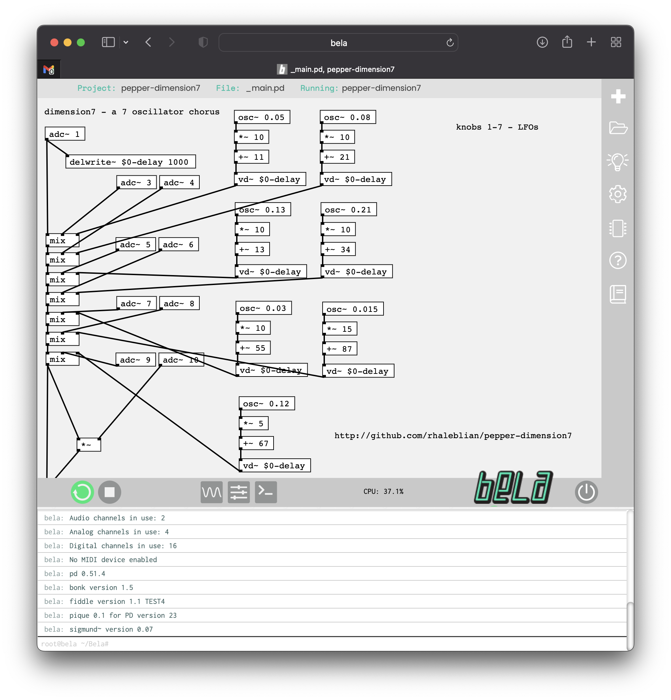

# Dimension 7

A 7-oscillator chorusing effect for Bela Pepper.

Knobs 1-7 mix in the LFOs and knob 8 controls the output volume.

Monophonic, left channel.

## Installation

To use, clone into the ~/Bela/projects directory.

## References

http://bela.io
